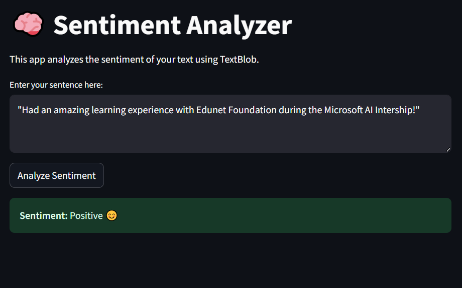

# Sentiment Analysis Project 😊

This is a simple Sentiment Analyzer app built with **Python**,**TextBlob**, and **Streamlit**

## 🔍 Features

- Analyze the sentiment of a single sentence (Positive,Neutral, or Negative).
- Built with a clean and friendly user interface using Streamlit.

## 🛠️ How to Run
1. Clone this repository:

git clone https://github.com/umadevisri/sentiment_analysis.git

2. Navigate to the project folder:

cd sentiment_analysis_project

3. Install the requirements.txt

pip install -r requirements.txt

4. Run the app:

streamlit run app.py
## 📦 Dependenices

- Streamlit
- textblob
- pandas
# 📁 Files

- `app.py` - The main Streamlit application.
- `requirements.txt` - List of Python Libraries.
- `README.md` - This file.

## 📸 Screenshot

## 👨‍💻Author
- Umadevisri
- Created during the internship program on foundation of artifical intelligence brought by Edunet Foundation
## Acknowledgment
"Thank you to Microsoft and Edunet Foundation for giving me this learning opportunity."
